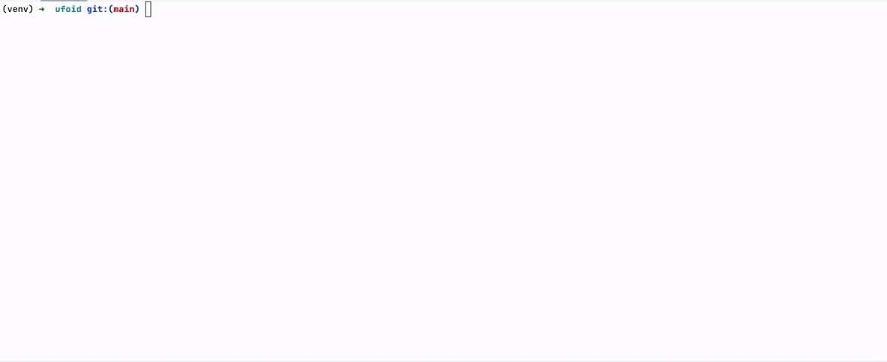

<div align="center">


</div>

# UFOID

> Ultra Fast Optimized Image Deduplication.


<div align="center">


</div>

## Table of Contents

- [Introduction](#introduction)
- [Installation](#installation)
- [Configuration](#configuration)
- [Results](#results)
- [Benchmarks](#benchmarks)
- [Changelog](#changelog)
- [Contributing](#contributing)
- [Powered Apps](#powered-apps)
- [Support](#support)

## Introduction

The goal of this project is to efficiently detect and handle duplicate images within a dataset and across different
datasets. The code uses perceptual hashing (image hashing) to convert images into hash representations, allowing for
quick comparison and identification of duplicate images based on a specified distance threshold.

The project provides two main functionalities:

1. Duplicate detection within a single dataset using chunks: this method processes the dataset in smaller chunks to
   optimize performance for large datasets.
2. Duplicate detection between two datasets using chunks: this method allows for comparison between a reference dataset
   and a new dataset to identify any overlapping duplicate images.

The competitor [imagededup](https://github.com/idealo/imagededup) library, running on hash_sizes of 8 bit, demonstrates
fast degradation of accuracy when increasing threshold, and shows heavy degradation of computation time when duplicates
increase for false positives. In contrast, our library, shows consistent results over higher threshold (and this can be
important to detect near-duplicates as shown in the accuracy benchmark). Furthermore, despite running on 16-bit hashes,
the strong computation optimization allow our library to be faster in a consistent way (more than double speed on 100k datasets).
More details can be found in benchmarks [README](./benchmarks/README.md).

## Installation

### Clone UFOID

```shell
git clone https://github.com/immobiliare/ufoid
cd ufoid
```

### Create virtualenv and install requirements

In order to create a clean environment for the execution of the application, a new virtualenv should be created
inside the current folder, using the command

```console
python3 -m venv venv
```

A new folder named `venv` will be created in `.`

In order to activate the virtualenv, execute

```console
source venv/bin/activate
```

and install python requirements executing

```console
pip install -r requirements.txt
```

if you are interested in running the benchmarks and/or the tests execute also

```console
pip install -r requirements-benchmark.txt
pip install -r requirements-test.txt
```

A different approach consists in using the Makefile by running from the project root the command

```console
make
```

This operation will:

- create the venv;
- update pip to the latest version;
- install the requirements;
- install the git hook.

## Configuration

Clone `ufoid/config/config.yaml.example` and rename it as `config.yaml` allows you to customize various aspects of the
duplicate detection process.
Here are some key parameters you can modify:

- `num_processes`: Number of processes for parallel execution.
- `chunk_length`: The length of each chunk for chunk-based processing. See below for more information.
- `new_paths`: List of directory paths containing the new dataset for duplicate detection.
- `old_paths`: List of directory paths containing the old dataset for comparison with the new dataset.
- `check_with_itself`: Boolean flag to indicate whether to check for duplicates within the new dataset.
- `check_with_old_data`: Boolean flag to indicate whether to check for duplicates between the new and old datasets.
- `csv_output`: Boolean flag to indicate whether to save duplicate information to the output file.
- `csv_output_file`: Path to the output file where duplicate information will be saved.
- `delete_duplicates`: Boolean flag to indicate whether to delete duplicate images from the dataset.
- `create_folder_with_no_duplicates`: Boolean flag to indicate whether to create a folder with non-duplicate images.
- `new_folder`: Path to the folder where non-duplicate images will be stored.
- `distance_threshold`: The distance threshold for considering images as duplicates. 10 is optimal for our use case,
  since it allows to get all the exact duplicate (also with some resilience to minor manipulations on images, while
  avoiding collisions.

#### Chunk length

`chunk_length` is an important parameter used in chunk-based processing to divide a large number of images into smaller,
manageable chunks during the duplicate detection process. The size of each chunk is crucial as it directly affects
memory usage and processing efficiency. By breaking down the dataset into chunks, we can prevent running out of memory
and optimize the performance of the duplicate detection algorithm.

The optimal value of `chunk_length` can vary depending on the hardware specifications of the machine running the
process. For instance, on a machine with limited memory, such as an Apple M1 with 16 GB of RAM, a smaller `chunk_length`
, like 20,000, has been found to work well. However, on a machine with more memory, a larger `chunk_length` might be
suitable.

It is essential to find a balance between the size of the chunks and the available system resources. If
the `chunk_length` is too small, it may lead to a large number of iterations and increased overhead. On the other hand,
if it is too large, it may cause the process to exhaust available memory, leading to performance issues or even crashes.

To determine the appropriate `chunk_length` for your specific system, it is recommended to experiment with different
values and observe the memory usage and performance of the duplicate detection process. This way, you can fine-tune the
parameter to best suit your hardware configuration and dataset size.

#### Distance threshold

The `distance threshold` is a fundamental parameter that controls the level of sensitivity in duplicate image detection.
By setting the distance threshold to 0, the algorithm will only identify exact duplicates—images that are pixel-by-pixel
identical. As the threshold is increased, the detection becomes more permissive, allowing for the identification of
near-duplicates with minor alterations such as changes in brightness, compression artifacts, or minor edits.

For instance, when using a distance threshold of 10, the algorithm can identify quasi-duplicates, even if the images
have undergone slight modifications, making it suitable for scenarios where minor image manipulations may occur. Raising
the threshold to 30 enables the detection of images with more substantial changes, providing increased flexibility while
still avoiding unnecessary collision with unrelated images.

However, as the threshold reaches higher values, like 60, it becomes more inclusive and may lead to the detection of
heavily manipulated images, potentially causing collisions with very similar images that are not actual duplicates. For
example, two images may share a common scene, but one of them might have a significant addition, like a large printed
word, which can trigger false positives.

It's essential to choose an appropriate distance threshold based on the characteristics of the dataset and the specific
use case. A balance must be struck between catching meaningful duplicates while minimizing the chances of identifying
false positives or unrelated images as duplicates. Experimenting with different threshold values and observing the
results will help determine the most suitable value for a particular scenario.

## Results

Start the script using the following command:

```console
python -m ufoid
```

After running the script, the duplicate detection process will complete, and the output will be displayed in
the console. The detected duplicate image pairs will be saved to the specified output file (if `txt_output` is set
to `true`).

Additionally, based on the configuration, a folder with non-duplicate images may be created, and duplicate images may be
deleted from the dataset.

## Benchmarks

In `benchmarks/scripts` different scripts to perform params optimization of UFOID and performance tests are provided.
For more details check dedicated [README](./benchmarks/README.md).

## Changelog

See [CHANGELOG](./CHANGELOG.md).

## Contributing

We appreciate all contributions. If you are planning to contribute back bug-fixes, please do so without any further
discussion.

If you plan to contribute new features, utility functions, or extensions to the core, please first open an issue and
discuss the feature with us.
Sending a PR without discussion might end up resulting in a rejected PR because we might be taking the core in a
different direction than you might be aware of.

To learn more about making a contribution, please see our [Contribution page](./CONTRIBUTING.md).

## Powered apps

UFOID was created by ImmobiliareLabs, the technology department of [Immobiliare.it](https://www.immobiliare.it),
the #1 real estate company in Italy.

**If you are using UFOID [drop us a message](mailto:opensource@immobiliare.it)**.

## Support

Made with ❤️ by [ImmobiliareLabs](https://github.com/immobiliare) and all the
[contributors](./CONTRIBUTING.md#contributors).

If you have any question on how to use UFOID, bugs and enhancement please feel free to reach us out by opening a
[GitHub Issue](https://github.com/immobiliare/ufoid/issues).
