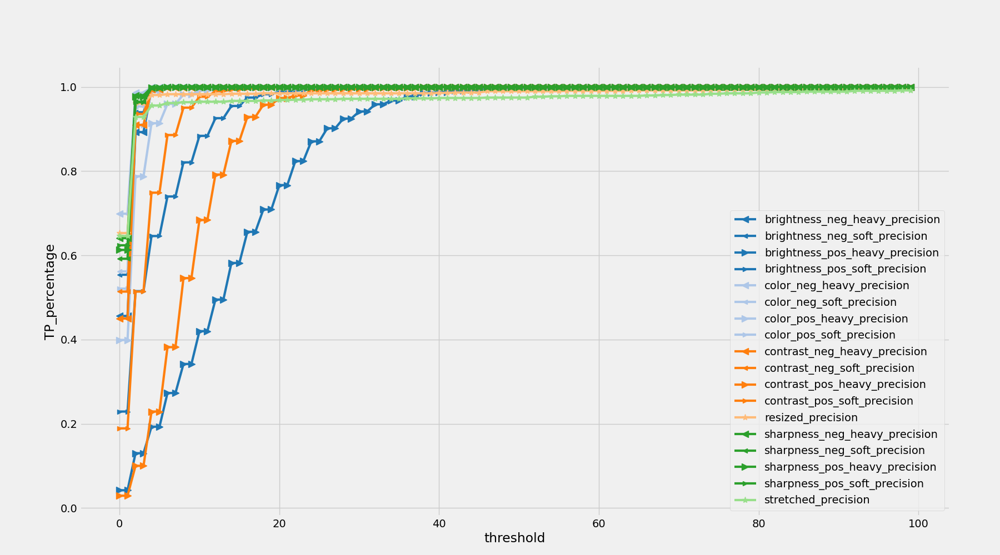
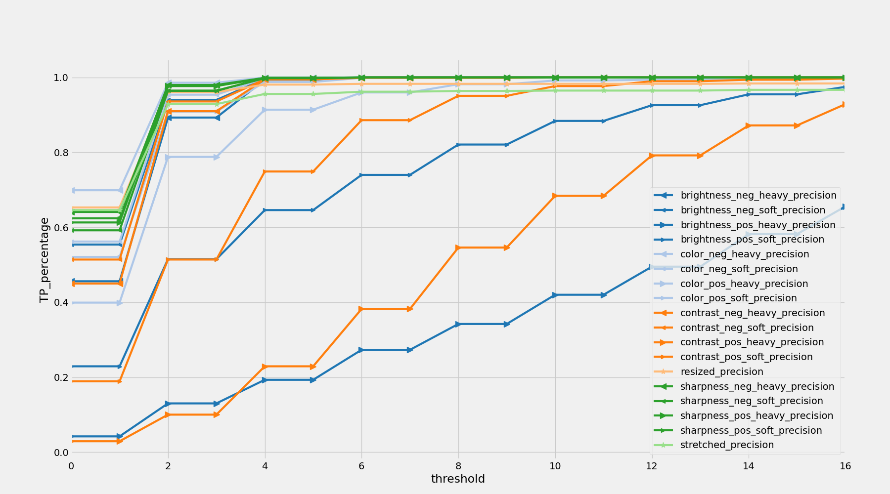

# Benchmark Documentation

# Stability benchmark

## Overview

This benchmark covers a range of image manipulation techniques, including contrast adjustment, sharpness enhancement, 
color correction, and brightness alteration, to comprehensively assess model performance and evaluate accuracy/collision 
trade-off in relation to threshold increasing.
This benchmark helps us analyze the precision of model predictions as well as the occurrence of collisions between 
manipulated and virgin images. The results are saved as a CSV file, and precision and collision plots are generated for 
a detailed evaluation.

## Dataset

The Stability Benchmark dataset consists of both virgin and manipulated images.
Virgin images are obtained from the [UKbench](https://archive.org/details/ukbench) original dataset, taking an image from the first 1000 image groups 
of the UKBench dataset.
Manipulated images are generated by applying various image enhancement techniques with different intensities 
(20% and 50%), such as contrast adjustment (positive and negative), sharpness enhancement (positive and negative), 
color correction (positive and negative), and brightness alteration (positive and negative).
The dataset also includes resized and stretched versions of the virgin images. This diverse set of images ensures a 
comprehensive evaluation of model performance.

## Results

| threshold | brightness_neg_heavy_precision | brightness_neg_soft_precision | brightness_pos_heavy_precision | brightness_pos_soft_precision | color_neg_heavy_precision | color_neg_soft_precision | color_pos_heavy_precision | color_pos_soft_precision | contrast_neg_heavy_precision | contrast_neg_soft_precision | contrast_pos_heavy_precision | contrast_pos_soft_precision | resized_precision | sharpness_neg_heavy_precision | sharpness_neg_soft_precision | sharpness_pos_heavy_precision | sharpness_pos_soft_precision | stretched_precision | collisions | collisions_percentage |
|-----------|--------------------------------|-------------------------------|--------------------------------|-------------------------------|---------------------------|--------------------------|---------------------------|--------------------------|------------------------------|-----------------------------|------------------------------|-----------------------------|-------------------|-------------------------------|------------------------------|-------------------------------|------------------------------|---------------------|------------|-----------------------|
| 0         | 0.456                          | 0.554                         | 0.042                          | 0.229                         | 0.699                     | 0.562                    | 0.399                     | 0.521                    | 0.45                         | 0.514                       | 0.029                        | 0.189                       | 0.632             | 0.641                         | 0.592                        | 0.613                         | 0.624                        | 0.627               | 0          | 0.0                   |
| 2         | 0.893                          | 0.94                          | 0.13                           | 0.515                         | 0.986                     | 0.954                    | 0.788                     | 0.909                    | 0.91                         | 0.936                       | 0.1                          | 0.514                       | 0.96              | 0.98                          | 0.965                        | 0.977                         | 0.964                        | 0.92                | 0          | 0.0                   |
| 4         | 0.994                          | 0.996                         | 0.193                          | 0.646                         | 1.0                       | 0.998                    | 0.914                     | 0.988                    | 0.995                        | 0.995                       | 0.229                        | 0.749                       | 0.98              | 0.999                         | 0.998                        | 0.999                         | 0.999                        | 0.947               | 0          | 0.0                   |
 | 8         | 1.0                            | 1.0                           | 0.342                          | 0.821                         | 1.0                       | 1.0                      | 0.982                     | 1.0                      | 0.999                        | 1.0                         | 0.546                        | 0.951                       | 0.984             | 1.0                           | 1.0                          | 1.0                           | 1.0                          | 0.964               | 0          | 0.0                   |
| 16        | 1.0                            | 1.0                           | 0.656                          | 0.975                         | 1.0                       | 1.0                      | 0.998                     | 1.0                      | 1.0                          | 1.0                         | 0.929                        | 0.997                       | 0.984             | 1.0                           | 1.0                          | 1.0                           | 1.0                          | 0.969               | 0          | 0.0                   |
| 32        | 1.0                            | 1.0                           | 0.959                          | 1.0                           | 1.0                       | 1.0                      | 1.0                       | 1.0                      | 1.0                          | 1.0                         | 0.998                        | 1.0                         | 0.986             | 1.0                           | 1.0                          | 1.0                           | 1.0                          | 0.974               | 0          | 0.0                   |
| 64        | 1.0                            | 1.0                           | 1.0                            | 1.0                           | 1.0                       | 1.0                      | 1.0                       | 1.0                      | 1.0                          | 1.0                         | 1.0                          | 1.0                         | 0.988             | 1.0                           | 1.0                          | 1.0                           | 1.0                          | 0.986               | 0          | 0.0                   |
| 128       | 1.0                            | 1.0                           | 1.0                            | 1.0                           | 1.0                       | 1.0                      | 1.0                       | 1.0                      | 1.0                          | 1.0                         | 1.0                          | 1.0                         | 1.0               | 1.0                           | 1.0                          | 1.0                           | 1.0                          | 1.0                 | 10452761   | 0.5812902346791236    |
| 176       | 1.0                            | 1.0                           | 1.0                            | 1.0                           | 1.0                       | 1.0                      | 1.0                       | 1.0                      | 1.0                          | 1.0                         | 1.0                          | 1.0                         | 1.0               | 1.0                           | 1.0                          | 1.0                           | 1.0                          | 1.0                 | 17982000   | 1.0                   |


This table and the accompanying plots (Fig 1-3) provide valuable insights into the performance of a model in a stability benchmark for image deduplication. Here's what can be inferred from the data:

This table and the accompanying plots provide valuable insights into the performance of a model in a stability benchmark for image deduplication. Here's what can be inferred from the data:

- **Threshold Impact**: As the threshold increases, precision improves consistently for all techniques (Fig.1 . Collisions slowly start to appear around threshold 100, then grow up very fast with a sinusoidal behaviour (Fig 3).
- **Variability in Techniques**: There's variability in precision across different image manipulation techniques. The hardest duplicates to catch are the ones where brightness or contrast is increased (but not decreased) and the streched ones.

In summary, this table and the associated plots demonstrate how precision in image deduplication can be optimized by adjusting the threshold value, with some image manipulation techniques being more amenable to detection. This information is valuable for users to make informed decisions about the threshold setting that best aligns with their application's precision and recall requirements.

<div align="center">
    
    <br>
    <sub>Figure 1: Stability Benchmark Precision</sub>
</div>

<div align="center">
    
    <br>
    <sub>Figure 2: Stability Benchmark Precision Zoomed In</sub>
</div>

<div align="center">
    
    <br>
    <sub>Figure 3: Stability Benchmark Collisions</sub>
</div>


# Optimization benchmark

### Documentation: UFOID Benchmarking Script

#### Overview
This script benchmarks UFOID’s duplicate detection performance on synthetic image datasets. 
It tests various configurations such as the number of processes and chunk sizes, measuring the time required to detect 
duplicates in the datasets. It is useful to understand the optimal configuration for your scenario. 
The results are saved to a CSV file for analysis.

### What the Script Does

1. **Generates Synthetic Datasets**:
   - The script uses the `generate_n_random_images` function to create datasets with random images. 
   It can control the number of images, their size, and the percentage of duplicate images in each dataset.
  
2. **Benchmarks UFOID**:
   - For each dataset configuration, the script runs UFOID's duplicate detection using various combinations of:
     - Number of processes (`num_processes`) for parallel execution.
     - Chunk sizes (`chunk_length`) for dividing the dataset into smaller groups.
   - It measures the time taken for each combination and saves the result.

3. **Handles Early Stop**:
   - If enabled (`early_stop: True`), the script can stop further iterations for a given dataset once it detects a 
     configuration where performance starts to degrade.

4. **Saves Results**:
   - Compiles all benchmark results (number of images, processes, chunk sizes, image sizes, duplicates, time taken) 
     into a CSV file for further analysis.

### How to Use the Script

#### 1. Write the Configuration File

The configuration file (`optimization.yaml`) is written in YAML format and defines the parameters for the benchmarking 
tests. You find an example in `benchmarks/scripts/config/optimization.yaml.example`.

#### Explanation of Configuration Fields

##### **GENERAL**:
- **`early_stop`**: 
  - If `True`, the script will stop further iterations if a configuration performs worse than a previous one. 
    (test are performed from the lowest to the highest num_processes and chunk_size). This is useful to save time.

##### **DATASETS**:
This section defines the datasets to be used for benchmarking. Each dataset has:
- **`name`**: A dataset name for logging purpose.
- **`image_size`**: The size (in pixels) of the images to be generated (e.g., 300x300).
- **`image_numbers`**: The total number of images in the dataset (e.g., 30,000).
- **`duplicates_percentages`**: The percentage of duplicate images in the dataset (e.g., 1% or 30%).

##### **UFOID_PARAMS**:
This section defines the parameters for the UFOID benchmarking process:
- **`num_processes`**: A list of the number of processes to be tested for parallel execution. 
For example, the script will test both 4 and 6 processes.
- **`chunk_lengths`**: A list of chunk sizes (number of images per chunk) to be used when splitting the dataset. 
For example, the script will test chunk sizes of 10,000, 20,000, and 25,000 images.

#### 3. Run the Script
Once you’ve set up the configuration file, simply run the script:

```bash
python -m benchmarks.scripts.optimization
```

### CSV Output

After the script runs, a CSV file named `optimization.csv` will be created in the `results/csv/` folder. The CSV will have the following columns:
- **`dataset_name`**: The name of the synthetic dataset. 
- **`n_of_images`**: The number of images in the dataset.
- **`n_of_processes`**: The number of processes used in parallel.
- **`chunk_length`**: The size of the chunk (number of images per chunk).
- **`image_size`**: The dimensions of the images (e.g., 300x300).
- **`duplicates_percentage`**: The percentage of duplicate images in the dataset.
- **`time (s)`**: The time (in seconds) taken by UFOID to process the dataset.

## Benchmark Results

The following results are generated with Google Cloud Platform machine with 8 CPUs and 8 GB RAM:

| dataset\_name      | n\_of\_images | n\_of\_processes | chunk\_length | image\_size | duplicates\_percentage | time \(s\) |
|:-------------------|:--------------|:-----------------|:--------------|:------------|:-----------------------|:-----------|
| 10k-1%-duplicates  | 10000         | 6                | 30000         | 300         | 0.01                   | 11.113     |
| 10k-1%-duplicates  | 10000         | 6                | 20000         | 300         | 0.01                   | 11.153     |
| 10k-1%-duplicates  | 10000         | 6                | 10000         | 300         | 0.01                   | 11.259     |
| 10k-1%-duplicates  | 10000         | 4                | 30000         | 300         | 0.01                   | 12.37      |
| 10k-1%-duplicates  | 10000         | 4                | 20000         | 300         | 0.01                   | 12.482     |
| 10k-1%-duplicates  | 10000         | 4                | 10000         | 300         | 0.01                   | 12.56      |
| 10k-30%-duplicates | 10000         | 6                | 20000         | 300         | 0.3                    | 14.049     |
| 10k-30%-duplicates | 10000         | 6                | 30000         | 300         | 0.3                    | 14.395     |
| 10k-30%-duplicates | 10000         | 6                | 10000         | 300         | 0.3                    | 14.608     |
| 10k-30%-duplicates | 10000         | 4                | 20000         | 300         | 0.3                    | 15.208     |
| 10k-30%-duplicates | 10000         | 4                | 30000         | 300         | 0.3                    | 15.267     |
| 10k-30%-duplicates | 10000         | 4                | 10000         | 300         | 0.3                    | 15.553     |
| 10k-1%-duplicates  | 10000         | 2                | 30000         | 300         | 0.01                   | 20.342     |
| 10k-1%-duplicates  | 10000         | 2                | 20000         | 300         | 0.01                   | 20.613     |
| 10k-1%-duplicates  | 10000         | 2                | 10000         | 300         | 0.01                   | 20.812     |
| 10k-30%-duplicates | 10000         | 2                | 20000         | 300         | 0.3                    | 22.961     |
| 10k-30%-duplicates | 10000         | 2                | 10000         | 300         | 0.3                    | 24.572     |
| 10k-30%-duplicates | 10000         | 2                | 30000         | 300         | 0.3                    | 28.488     |

# Benchmark against image dedup

### Overview
This script benchmarks two libraries UFOID (our proposal) and its main opensource alternative [imagededup](https://github.com/idealo/imagededup), for 
their performance in detecting duplicate images. It can run the benchmark on multiple datasets (synthetic or real) and saves the results to a CSV file 
for further analysis.

### Datasets
Performance benchmark can be performed on any kind of datasets:

#### imagededup
This dataset is the [UKbench](https://archive.org/details/ukbench). An image from each of the 2550 image groups of the UKBench dataset was taken and 
an exact duplicate was created. The number of images totalled 5100. This choice is consistent with the 
"Exact duplicate dataset" as created by [imagededup benchmark](https://idealo.github.io/imagededup/user_guide/benchmarks/).

#### synth
The script uses the `generate_n_random_images` function to create datasets with random images. 
It can control the number of images, their size, and the percentage of duplicate images in each dataset.

#### local
A user custom dataset, images' names must have the following structure: `{image_name}-{image_number}.{extension}`.
For example `dog-1.jpg`, `cat-1.jpg`, `dog-2.jpg`, `cat-2.jpg`, `dog-3.jpg`, `giraffe-1.jpg`.

### What the Script Does

1. **Dataset Setup**:
   - The script can generate synthetic datasets, download predefined datasets, or use a custom local dataset.
   - Synthetic datasets are created using the `generate_n_random_images` function, where the number of images, image size, and percentage of duplicates can be configured.

2. **Duplicate Detection**:
   - Two methods are benchmarked for finding duplicate images:
     - **UFOID**: Uses the UFOID library for duplicate detection, processing in parallel and with a distance threshold for matching images.
     - **ImageDedup**: Uses the `imagededup` library with `PHash` for duplicate detection, supporting multi-threading.
   - For both methods, the script measures the time taken to process each dataset.

3. **Evaluation**:
   - If precision evaluation is enabled, the script compares the retrieved duplicates with ground truth data (if available) and computes precision and recall metrics.

4. **Timeout Handling**:
   - A configurable timeout is enforced for each benchmark run, ensuring that the script doesn’t get stuck on large datasets or poorly performing configurations.

5. **Results Storage**:
   - The results, including precision, recall, time taken, and configuration details, are saved to a CSV file for analysis.

### How to Use the Script

#### 1. Write the Configuration File

An example of the configuration file is located in `benchmarks/scripts/config/performance.yaml.example`.

#### Explanation of Configuration Fields

##### **GENERAL**:
- **`timeout`**: 
  - The maximum time (in seconds) allowed for each benchmarking run. If exceeded, the run is stopped.

##### **DATASETS**:
- **`type`**: Defines the type of dataset to use:
  - `"imagededup"`: Downloads and prepares the `imagededup` dataset.
  - `"synth"`: Generates a synthetic dataset. The dataset name, image count, image size, and duplicate percentage must be specified.
  - `"local"`: Uses a custom dataset located at the provided path. 
- **`name`**: The name of the synthetic dataset to be generated.
- **`image_count`**: Number of images in the synthetic dataset.
- **`image_size`**: Dimensions of the generated images (e.g., 256x256 pixels).
- **`duplicates_percentage`**: The percentage of duplicate images in the dataset.

##### **MODELS**:
The two implemented models are `ufoid` and `imagededup`, for each of these we have:  
- **`active`**: Enables or disables the model for benchmarking.
- **`precision_eval`**:
  - **`active`**: If set to `true`, precision and recall metrics will be evaluated (requires ground truth data).
  - **`thresholds`**: Specifies the distance thresholds to be tested for duplicate detection. Higher values allow for more lenient matching.

#### 2. Run the Script
Once the configuration file is prepared, you can run the script:

```bash
python -m benchmarks.scripts.performance
```

### CSV Output

After running the script, a CSV file named `vs_image_dedup_benchmark.csv` is created in the `results/csv/` folder. The CSV contains the following columns:
- **`dataset`**: The name of the dataset.
- **`num_images`**: The number of images in the dataset.
- **`lib`**: The library used (`imagededup` or `ufoid`).
- **`threshold`**: The threshold used for duplicate detection.
- **`non_duplicate_precision`**: The precision for non-duplicate images (if ground truth is available).
- **`duplicate_precision`**: The precision for duplicate images (if ground truth is available).
- **`non_duplicate_recall`**: The recall for non-duplicate images (if ground truth is available).
- **`duplicate_recall`**: The recall for duplicate images (if ground truth is available).
- **`time (s)`**: The time taken to complete the duplicate detection.

## Results

Imagededup library, running on hash_sizes of 8 bit, demonstrates fast degradation of accuracy when increasing threshold, and shows heavy degradation of computation time when duplicates increase for false positives.
In contrast, our library, shows consistent results over higher threshold (and this can be important to detect near-duplicates as shown in the accuracy benchmark).
Furthermore, despite running on 16-bit hashes, the strong computation optimization allow our library to be faster in a consistent way.

First test wad made on the `imagededup` dataset (available [here](https://archive.org/download/ukbench/ukbench.zip)), that 
consists in 2550 couples of duplicated images, for 5100 images in total. 
The following results were generated with Google Cloud Platform machine with 8 CPUs and 8 GB RAM:

| Dataset               | Num Images | Lib        | Threshold | Non Duplicate Precision | Duplicate Precision | Non Duplicate Recall | Duplicate Recall | Status     | Time (s) |
|-----------------------|------------|------------|-----------|-------------------------|---------------------|----------------------|------------------|------------|----------|
| image_dedup_benchmark | 5100       | imagededup | 0         | 1.0                     | 1.0                 | 1.0                  | 1.0              | SUCCESSFUL | 14.414   |
| image_dedup_benchmark | 5100       | imagededup | 8         | 1.0                     | 0.992               | 1.0                  | 1.0              | SUCCESSFUL | 14.691   |
| image_dedup_benchmark | 5100       | imagededup | 16        | 1.0                     | 0.246               | 0.999                | 1.0              | SUCCESSFUL | 14.961   |
| image_dedup_benchmark | 5100       | ufoid      | 0         | 1.0                     | 1.0                 | 1.0                  | 1.0              | SUCCESSFUL | 12.534   |
| image_dedup_benchmark | 5100       | ufoid      | 8         | 1.0                     | 1.0                 | 1.0                  | 1.0              | SUCCESSFUL | 12.443   |
| image_dedup_benchmark | 5100       | ufoid      | 16        | 1.0                     | 1.0                 | 1.0                  | 1.0              | SUCCESSFUL | 12.457   |
| image_dedup_benchmark | 5100       | ufoid      | 32        | 1.0                     | 1.0                 | 1.0                  | 1.0              | SUCCESSFUL | 12.28    |
| image_dedup_benchmark | 5100       | ufoid      | 64        | 1.0                     | 0.998               | 1.0                  | 1.0              | SUCCESSFUL | 12.387   |

The second test was done, on the same hardware, using a 10k images synthetic dataset with 1% of duplicated images:

| Dataset   | Num Images | Lib        | Status     | Time (s) |
|-----------|------------|------------|------------|----------|
| synth_10k | 10000      | ufoid      | SUCCESSFUL | 13.32    |
| synth_10k | 10000      | imagededup | SUCCESSFUL | 26.684   |

The last test was done using a 100k images synthetic dataset with 1% of duplicates.  
The following results were generated with a M2 MacBook PRO with 16 GB RAM:

| dataset    | num_images | lib        | status     | time (s) |
|------------|------------|------------|------------|----------|
| synth_100k | 100000     | ufoid      | SUCCESSFUL | 258.387  |
| synth_100k | 100000     | imagededup | SUCCESSFUL | 553.865  |

